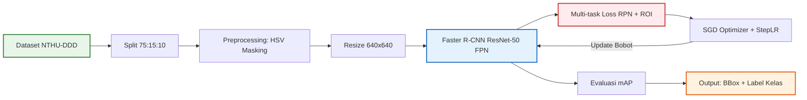

# 🛡️ VisionGuard: Driver Drowsiness Detection System

[](https://www.python.org/)
[](https://pytorch.org/)
[](https://opencv.org/)
[](https://eng.ui.ac.id/)
[](https://opensource.org/licenses/MIT)

**VisionGuard** adalah sistem deteksi kelelahan pengemudi (*Driver Drowsiness Detection*) berbasis *computer vision* yang dikembangkan menggunakan arsitektur **Faster R-CNN** dengan *backbone* **ResNet-50 FPN**. Proyek ini dibuat sebagai Proyek Pengganti UAS untuk mata kuliah **Kecerdasan Buatan (Artificial Intelligence)**, Departemen Teknik Komputer, Universitas Indonesia (Semester Genap 2025/2026).

Sistem ini dirancang untuk mendeteksi indikator kelelahan secara spasial (*bounding box*) dan mengklasifikasikan kondisi pengemudi secara *real-time* guna meminimalisir kecelakaan lalu lintas akibat *human error* (kantuk).

---

## 📌 Latar Belakang & Urgensi

Berdasarkan data dari Korlantas Polri pada tahun 2023, dari sekitar 148.000 kecelakaan lalu lintas di Indonesia, **61% di antaranya disebabkan oleh faktor manusia (*human error*)** seperti mengantuk, kelelahan, dan kurangnya konsentrasi. Kelalaian pengemudi selama 2 detik saja pada kecepatan tinggi dapat berdampak fatal.

Sebagian besar sistem deteksi kantuk yang ada saat ini menggunakan metode *global image classification* (mengklasifikasikan seluruh gambar sebagai "kantuk" atau "normal") yang kurang transparan dan tidak memberikan informasi spasial. **VisionGuard** menyelesaikan masalah ini dengan menggunakan *object detection* berbasis **Faster R-CNN**, yang tidak hanya mengklasifikasikan kondisi pengemudi tetapi juga menunjukkan koordinat area wajah/mulut/mata (*bounding box*) yang memicu alarm keselamatan.

---

## 🚀 Fitur Utama

- **Two-Stage Object Detection (Faster R-CNN)**: Akurasi lokalisasi spasial yang sangat tinggi dibanding detektor *single-stage* konvensional pada area deteksi kecil.
- **Deteksi 4 Kelas Perilaku**:
  - `notdrowsy` (Normal / Fokus)
  - `yawning` (Menguap)
  - `sleepyCombination` (Mata tertutup / *Micro sleep*)
  - `slowBlinkWithNodding` (Kedipan lambat yang disertai anggukan kepala)
- **Robustness Multi-skenario**: Teruji pada variasi pencahayaan siang/malam (inframerah) serta penggunaan aksesoris (kacamata biasa & kacamata hitam).
- **Auto Bbox Extraction**: Pra-pemrosesan citra cerdas menggunakan *HSV Masking* untuk mendeteksi dan mengekstraksi kotak batas kelas dari dataset video.
- **Model Quantization**: Optimasi ukuran model untuk kesiapan *deployment* pada perangkat *edge* dengan sumber daya komputasi terbatas.

---

## 📐 Arsitektur Sistem

Model ini menggunakan arsitektur **Faster R-CNN** dengan *backbone* **ResNet-50** dan **Feature Pyramid Network (FPN)** untuk mendeteksi fitur pada berbagai skala citra.

### Alur Kerja Sistem (End-to-End)


### Mekanisme Faster R-CNN
1. **Feature Extractor**: Jaringan ResNet-50 mengekstrak *feature map* dari gambar input.
2. **Feature Pyramid Network (FPN)**: Membangun piramida fitur multi-skala agar model peka terhadap ukuran wajah yang bervariasi.
3. **Region Proposal Network (RPN)**: Menghasilkan kandidat kotak pembatas (*anchor boxes*) dengan berbagai rasio aspek dan menghitung skor keberadaan objek (*objectness score*).
4. **RoI Align**: Melakukan interpolasi bilinear untuk mengubah ukuran kandidat wilayah (*Region of Interest*) menjadi ukuran tetap.
5. **Output Heads**: Jaringan bercabang menjadi klasifikasi kelas (4 kelas + 1 *background*) dan regresi kotak pembatas (*bounding box*).

---

## 📊 Dataset & Pra-pemrosesan

Proyek ini menggunakan dataset **NTHU Driver Drowsiness Detection (NTHU-DDD) Multi-Class** yang terdiri dari **66.521 gambar** beresolusi $640 \times 640$ piksel.

### Distribusi Kelas & Pembagian Data
- **Rasio Pembagian**: 75% Training, 15% Validation, 10% Testing (Random Seed: 42)

| Subset | Jumlah Sampel | Rasio (%) |
| :--- | :---: | :---: |
| **Training** | 49.890 | 75% |
| **Validation** | 9.978 | 15% |
| **Testing** | 6.653 | 10% |
| **Total** | **66.521** | **100%** |

- **Pra-pemrosesan**: Ekstraksi koordinat kotak penanda kelas menggunakan *HSV Masking* (mengisolasi warna kotak pendeteksi bawaan pada dataset) lalu memotong/menyesuaikan anotasi menjadi format Pascal VOC untuk *training* PyTorch.

---

## ⚙️ Instalasi & Setup

### 1. Prasyarat Jaringan & Perangkat Keras
- Direkomendasikan menggunakan Google Colab dengan GPU Tesla T4 (atau GPU lokal berkemampuan CUDA dengan VRAM minimal 8GB).
- Python 3.8+

### 2. Kloning Repositori
```bash
git clone https://github.com/Deann7/FinalProject_CNN_Kel02_KecerdasanBuatan-01.git
cd FinalProject_CNN_Kel02_KecerdasanBuatan-01
```

### 3. Instalasi Dependensi
Instal pustaka yang dibutuhkan menggunakan pip:
```bash
pip install torch==2.2.2 torchvision==0.17.2 opencv-python albumentations==1.4 torchmetrics==1.4 matplotlib scikit-learn pycocotools
```

### 4. Menjalankan Kode Eksperimen
Buka dan jalankan seluruh sel pada Jupyter Notebook utama:
```bash
jupyter notebook drowsiness_detection_faster_rcnn.ipynb
```
Notebook ini mencakup langkah-langkah:
1. Pemasangan dependensi dan pemastian environment GPU CUDA.
2. Pengunduhan dataset NTHU-DDD dari Kaggle secara otomatis menggunakan Kaggle API.
3. Ekstraksi koordinat anotasi melalui OpenCV HSV Masking.
4. Definisi *Custom PyTorch Dataset* dan *DataLoader* dengan augmentasi Albumentations.
5. Inisialisasi arsitektur Faster R-CNN dan proses transfer learning.
6. Evaluasi berkala menggunakan metrik mAP.
7. Penerapan kuantisasi pasca-pelatihan (*post-training quantization*) dan komparasi hasil.

---

## 📈 Eksperimen & Hasil Evaluasi

### Konfigurasi Hyperparameter Pelatihan
- **Optimizer**: SGD (Momentum = 0.9, Weight Decay = $5\times10^{-4}$)
- **Learning Rate**: Initial 0.005 dengan `StepLR` scheduler (Step Size = 7, Gamma = 0.1)
- **Batch Size**: 4
- **Epochs**: Maksimal 20 (Best Model dicapai pada Epoch 3)
- **NMS Threshold**: 0.4
- **Score Threshold**: 0.5

### Performa Model Terbaik (Epoch 3) pada Test Set (6.653 gambar)

| Metrik Evaluasi | Nilai Kuantitatif |
| :--- | :---: |
| **mAP@[0.5:0.95] (Standard COCO)** | **0.8749** |
| **mAP@0.50 (Loose Localization)** | **0.9343** |

### Performa Detail Per Kelas (mAP@[0.5:0.95])

| Nama Kelas | Nilai mAP | Karakteristik & Fitur Dominan |
| :--- | :---: | :--- |
| `sleepyCombination` | **0.9175** | Fitur spasial mata terpejam penuh sangat distingtif. |
| `yawning` | **0.8680** | Fitur mulut terbuka lebar dan kepala sedikit menengadah. |
| `slowBlinkWithNodding` | **0.8572** | Fitur dinamis (kedipan lambat + anggukan); sedikit sulit pada gambar statis. |
| `notdrowsy` | **0.8568** | Kondisi normal; kadang terkeliru sebagai kedipan lambat di single frame. |

### Visualisasi Hasil
Visualisasi performa pelatihan dan prediksi inferensi dapat dilihat di folder `src/`:
- **Distribusi Kelas & Data**: `src/class_distribution.png` dan `src/split_distribution.png`
- **Matriks Kebingungan (Confusion Matrix)**: `src/confusion_matrix.png`
- **Sampel Prediksi Inferensi**: `src/test_predictions.png`
- **Verifikasi Bounding Box**: `src/bbox_verification.png`

---

## 👥 Anggota Kelompok 02

| Nama Anggota | NPM | Peran Utama | Fokus Area & Kontribusi |
| :--- | :---: | :---: | :--- |
| **Benedict Aurelius** | 2306209095 | Lead Model Engineer | Training pipeline, hyperparameter tuning, evaluation pipeline, model saving/checkpointing. |
| **Deandro Najwan Ahmad S.** | 2306213174 | Dataset & Preprocessing Engineer | HSV masking bbox extraction, custom Dataset & DataLoader, Albumentations pipeline, data stratification. |
| **Nelson Laurensius** | 2306161845 | Metadata & Configuration Engineer | Repository structure, metadata JSON configuration, class mapping, threshold config. |
| **Wesley Frederick Oh** | 2306202763 | Visualization & Analysis Engineer | Inference script, confusion matrix plotting, error analysis, model quantization evaluation. |

---

## 📚 Referensi & Sitasi Utama

1. Ren, S., He, K., Girshick, R., & Sun, J. (2015). **Faster R-CNN: Towards real-time object detection with region proposal networks**. *Advances in Neural Information Processing Systems (NeurIPS)*, 28, 91-99.
2. Weng, C. H., Lai, Y. H., & Lai, S. H. (2017). **Driver Drowsiness Detection via Hierarchical Temporal Deep Belief Networks**. *Proceedings of the IEEE Conference on Computer Vision and Pattern Recognition (CVPR) Workshops*.
3. He, K., Zhang, X., Ren, S., & Sun, J. (2016). **Deep residual learning for image recognition**. *Proceedings of the IEEE Conference on Computer Vision and Pattern Recognition (CVPR)*, 770-778.

---

## 🎓 Ucapan Terima Kasih
Terima kasih yang sebesar-besarnya kepada **Muhammad Firdaus Syawaludin Lubis, S.T., M.T., Ph.D.** selaku dosen pengampu mata kuliah Kecerdasan Buatan, serta Departemen Teknik Komputer, Universitas Indonesia atas bimbingan dan fasilitas yang diberikan selama pelaksanaan proyek ini.
